<div align="center">

# LoomCraft

**Agent-authored plans. Server-owned execution. A live graph.**

LoomCraft gives an agent room to decide *what should happen next* without giving
it the power to invent what already happened.

[English](README.md) · [简体中文](README.zh-CN.md)

[](packages/core/pyproject.toml)
[](packages/renderer/package.json)
[](packages/core/pyproject.toml)
[](#testing)
[](LICENSE)

[30-second demo](#see-the-graph-in-30-seconds) · [Quick start](#quick-start) · [Architecture](#architecture) · [Docs](docs/) · [Examples](examples/)

<br>



<sub>One plan, one event stream, three branches in flight. The picture is generated from the
same card geometry and status tokens as <code>@loomcraft/renderer</code>.</sub>

</div>

---

## The idea

Most agent SDKs stop at tool calls. Most workflow engines start with a graph that
was fixed before the user arrived. LoomCraft is the boundary between the two:
the model proposes a graph at runtime, while the host decides which operations
exist and the engine decides what is allowed to run.

| Layer | Owns | The boundary it keeps |
| --- | --- | --- |
| **Agent** | Intent, plan revisions, explanations | It can propose and inspect; it cannot mark a server operation complete. |
| **Broker** | Tool schemas, authorization, budgets | Every model action passes through one validated door. |
| **Engine** | Dependencies, concurrency, retries, artifacts | A step runs only when its graph preconditions are true. |
| **Renderer** | A projection of the event log | The UI never guesses state from a chat transcript. |

The distinctive rule is simple:

> **Parallelism is a property of the dependency graph, not a prompt keyword.**

If three nodes share a completed parent and have no edge between them, the
engine dispatches all three in the same scheduling pass. If one branch fails,
the graph records that fact and applies the declared failure policy; it does not
silently turn an incomplete run into a success.

## See the graph in 30 seconds

This is a real, offline run. No API key, network, scientific package, or
frontend build is required:

```bash
git clone https://github.com/jity16/Loomcraft.git
cd Loomcraft
python -m pip install -e packages/core
python examples/00-workbench-tour/run.py
```

The first example publishes an eleven-step plan, prints its dependency layers,
runs three independent branches concurrently, retries one transient step, and
waits at a human approval boundary before publishing the final report. The
output includes the measured overlap, not just a claim that the branches were
parallel:

```text
validation        cycle refused before execution=True
revision 1 · 11 steps
layer 0  normalize
layer 1  kinship + pca + phenotype       ← one scheduling pass
layer 2  scan.yield + scan.depth + scan.height
layer 3  qc.yield + qc.depth + qc.height
layer 4  report                           ← approval gate

parallel window  pca, phenotype, kinship  overlap=0.16s
retry            scan.depth               attempt 2/2
approval         report                   runner calls=0
run              succeeded                11/11 nodes accounted for
report runner    invoked after approval       calls=1
```

The longer scenarios in [`examples/`](examples/) use the same public contracts
to show input requests, artifact integrity, re-planning, tolerated failures,
review capabilities, SSE, and a JSON-RPC app-server bridge.
The complete source and visual for this first tour live in
[`examples/00-workbench-tour/`](examples/00-workbench-tour/).

## Quick start

### 1. Register the work your host permits

The registry is the seam between LoomCraft and your domain. A capability is a
typed contract plus one runner; LoomCraft never imports your business modules.

```python
from loomcraft import Capability, NodeContext, NodeResult, Port, Registry

registry = Registry()

@registry.capability_runner(Capability(
    id="table.profile",
    name="Profile a table",
    description="Count rows and report the column names.",
    runner="table.profile",
    outputs=(Port(name="profile", artifact_type="json"),),
))
async def profile(ctx: NodeContext) -> NodeResult:
    ctx.emit("profile", "profile.json", '{"columns": 12, "rows": 480}')
    return NodeResult.ok(summary="profile complete")
```

### 2. Give an agent a session and a broker

```python
from loomcraft import SessionStore, ToolBroker

session = SessionStore("./.loomcraft-data").create()
broker = ToolBroker(session, registry)
broker.begin_turn()

await broker.dispatch("publish_plan", {"plan": {
    "goal": "Profile the uploaded table",
    "revision": 1,
    "steps": [{
        "id": "profile",
        "title": "Profile the table",
        "kind": "capability",
        "capability": "table.profile",
    }],
}})
run = await broker.dispatch("execute_plan", {})
assert run.ok and run.result["status"] == "succeeded"
```

Replace the direct calls with `AnthropicAgent`,
`OpenAICompatibleAgent`, `SubprocessAgent`, or an implementation of the
`Agent.run_turn(...)` protocol; the
broker and engine guarantees do not change.

### 3. Add the renderer when you need a UI

```bash
cd packages/renderer
npm ci
npm run build
cd /your-app
npm install /path/to/Loomcraft/packages/renderer
```

```tsx
import { LoomWorkbench } from "@loomcraft/renderer";
import "@loomcraft/renderer/styles.css";

<LoomWorkbench sessionId={sessionId} baseUrl="/api/v1/loomcraft" />
```

Use only the pieces you need: `reduceLoomEvent` and `hydrateLoomState` are pure
functions, `LoomClient` handles HTTP/SSE resume, and `PlanGraph` can be embedded
without the full workbench.

## The plan shape

The opening example is intentionally shaped like a real investigation rather
than a linear hello-world:

```text
                         ┌─ scan.yield  ── qc.yield  ─┐
normalize ─┬─ pca ────────┤                             │
           ├─ phenotype ──┼─ scan.depth  ── qc.depth ──┼─ report
           └─ kinship ────┤                             │
                         └─ scan.height ── qc.height ─┘
```

The edges are execution preconditions. `pca`, `phenotype`, and `kinship` share
only `normalize`; they do not depend on one another, so they run together.
The same is true of the three scans and the three checks. There is no
`parallel=True` switch to forget, and no model turn spent serializing work that
the graph already says is independent.

## What LoomCraft guarantees

- **The graph is valid before it runs.** Cycles, duplicate ids, unknown
  dependencies, oversized plans, and unauthorized capabilities are rejected at
  the broker boundary.
- **The model cannot fake server-owned work.** `capability` and `workflow` steps
  are completed only by execution tools; review capabilities can make checks
  server-owned too.
- **Every result has a receipt.** Status changes, retries, progress, artifacts,
  approvals, and errors are append-only events with monotonically increasing
  sequence numbers and a verifiable hash chain.
- **Files are references, not paths.** `upload:`, `artifact:`, and `scratch:`
  refs are confined to a session and integrity-checked whenever they are read.
- **Recovery is explicit.** Retries are bounded, timeouts and cancellation are
  awaited, failure policies are visible, and a new plan revision must explain
  what changed.

## Architecture

```text
user request / files
        │
        ▼
  Agent / model runtime ── publishes ──► Plan + revision history
        │                              │
        │ tool calls                   ▼
        └──────────────────────► ToolBroker
                                      │ validates + authorizes
                                      ▼
                 host Registry ───► Engine ───► EventLog
                 (your runners)       │             │
                                      │             └── SSE / history
                                      ▼                    │
                                artifacts             Renderer
```

The canonical Python package lives in
[`packages/core/src/loomcraft/`](packages/core/src/loomcraft/). The React
package in [`packages/renderer/`](packages/renderer/) is independent of the
Python implementation and consumes the same event contract.

## Bring your own model runtime

All adapters land on the same broker:

| Runtime | Entry point |
| --- | --- |
| Anthropic | `AnthropicAgent()` |
| OpenAI-compatible Chat/Responses | `OpenAICompatibleAgent(...)` |
| Another process over JSONL | `SubprocessAgent([...])` |
| Codex or another app server | `AppServerBridge(broker)` |
| Your own model runtime | implement the `Agent.run_turn(...)` protocol |

`tools.py` emits one canonical tool catalog and adapts it to Anthropic, OpenAI,
Responses, and MCP dialects. Changing the model is a provider choice, not a
second execution path.

## Documentation and examples

Start with [`docs/README.md`](docs/README.md), then choose a path:

- [Concepts](docs/01-concepts.md) — plans, steps, capabilities, sessions, events
- [Defining plans](docs/02-defining-plans.md) — schema, validation, policies, objectives
- [Agent integration](docs/03-agent-integration.md) — tools, loops, providers, guardrails
- [Frontend integration](docs/04-frontend-integration.md) — reducer, SSE, components, theming
- [Extending](docs/05-extending.md) — runners, workflows, storage, transports
- [Architecture](docs/06-architecture.md) — design decisions and trade-offs
- [API reference](docs/07-api-reference.md) — public Python, TypeScript, events, endpoints

Runnable scenarios live in [`examples/README.md`](examples/README.md). Machine-
readable Plan, Event, and Tool contracts live in
[`packages/core/schema/`](packages/core/schema/).

## Testing

```bash
python -m pip install -e "packages/core[dev]"
python -m pytest -q                         # 257 Python tests
python -m ruff check packages/core/src --select F,E9,B023
python tools/check_docs.py

npm --prefix packages/renderer ci
npm --prefix packages/renderer run typecheck
npm --prefix packages/renderer run build
npm --prefix packages/renderer test             # 54 renderer tests
```

## License

MIT
