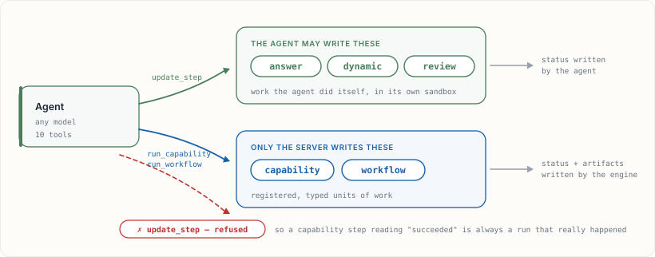
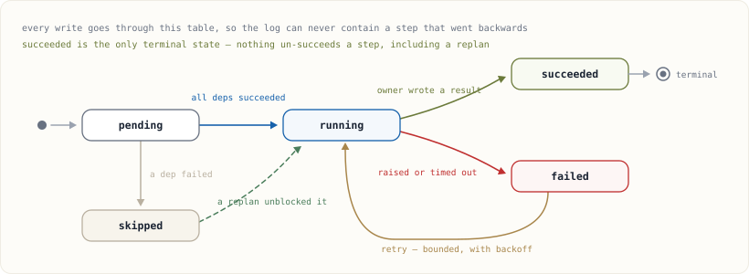
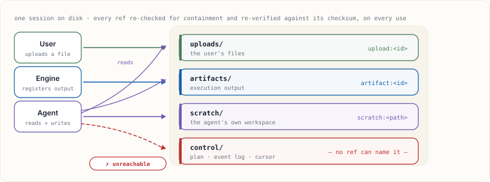

<div align="center">

# LoomCraft

**The agent authors the investigation. The runtime keeps it honest.**

An embeddable, provider-neutral runtime for work that changes as it learns:
scientific discovery, evidence synthesis, long-running analysis, and any
workflow where the next step depends on what the last step found.

[English](README.md) · [简体中文](README.zh-CN.md)

[](packages/core/pyproject.toml)
[](packages/renderer/package.json)
[](packages/core/pyproject.toml)
[](#testing)
[](LICENSE)

[Why LoomCraft](#for-work-that-takes-a-while) · [What it adds](#what-you-bring-what-loomcraft-adds) · [Architecture](#architecture) · [Quick start](#quick-start) · [Docs](docs/) · [Examples](examples/)

<br>


<sub>One evolving plan, three parallel layers, one auditable result. The picture uses the same
card geometry and status tokens as <code>@loomcraft/renderer</code>.</sub>

</div>

---

## For work that takes a while

Short tool calls are easy to orchestrate. The difficult work is open-ended:
you start with a question, collect evidence, discover that an assumption was
wrong, and need to continue tomorrow without losing what happened today.

LoomCraft treats that as a first-class execution model. A plan is versioned
data, not a prompt hidden in a transcript. Artifacts and events survive across
turns. Independent investigations run together. A human can approve a
side-effect before it starts. If a question cannot be answered, the record can
say why and what would make it answerable.

| Scenario | What changes during the work | LoomCraft gives you |
| --- | --- | --- |
| **Scientific discovery** | A diagnostic changes the method or adds a missing analysis | Revisions with reasons, objective/evidence coverage, artifact provenance, and review steps |
| **Literature or evidence review** | Missing files, incompatible studies, or an empty branch change the conclusion | Typed input requests, dependency-aware skips, retries, and an honest failure record |
| **Long-running data analysis** | Hours-long tools need retries, cancellation, resume, and partial progress | Whole-plan execution, bounded policies, persisted sessions, SSE replay, and artifacts |
| **Human-in-the-loop operations** | A result becomes an external action only after a person agrees | Approval gates before the runner is invoked, with an auditable decision event |
| **Agentic engineering/ops** | The model chooses the next diagnostic instead of following a fixed runbook | A narrow tool surface over host-owned capabilities, with the same graph and state guarantees |

The common thread is not the domain. It is uncertainty over time: the plan can
change, while the execution history stays trustworthy.

## What you bring. What LoomCraft adds.

LoomCraft is deliberately a seam, not a business application. You bring the
model runtime, domain functions, storage, and transport you already trust; the
library adds the contract and the guardrails around them.

| You bring | LoomCraft adds | The practical result |
| --- | --- | --- |
| Any model runtime | One canonical tool catalog and one broker boundary | Swap Claude, an OpenAI-compatible endpoint, a local JSONL process, or Codex without changing execution semantics |
| Domain functions and workflows | Typed inputs, parameters, output ports, and registry authorization | The agent can compose your operations, but cannot call arbitrary code or invent a capability |
| A graph of dependencies | DAG validation, deterministic layers, bounded parallel scheduling, retry, timeout, and cancellation | More throughput and more predictable recovery without a `parallel=True` flag |
| Files and intermediate results | Session-scoped source refs, checksum verification, artifact promotion, and revision history | Long runs can resume and be audited without passing host paths to a model or browser |
| An HTTP or app-server host | Optional FastAPI/SSE and JSON-RPC adapters | Live progress, reconnect/resume, approvals, and the same authorization path over the wire |
| A React application (or none) | A pure reducer, deterministic layout, SVG graph, and ready-made workbench | Render the same truth in React, another UI framework, or your own canvas |

### Connect any runtime

All of these adapters land on the same `ToolBroker` and `Engine`:

| Runtime | Entry point |
| --- | --- |
| Anthropic Messages | `AnthropicAgent()` |
| OpenAI-compatible Chat Completions | `OpenAICompatibleAgent(...)` |
| Another process over JSONL | `SubprocessAgent([...])` |
| Codex or another app server | `AppServerBridge(broker)` |
| Your own model loop | implement the `Agent.run_turn(...)` protocol |

`tools.py` emits one canonical catalog and adapts it to Anthropic, OpenAI,
Responses, and MCP dialects. Changing the model is a provider choice, not a
second execution path.

## Architecture

The model is allowed to propose. The host owns the catalog. The broker is the
only door. The engine is the only component that can make a server-owned step
true. The renderer is a projection of the event log, so a refresh and a live
stream converge on the same state.

```text
user question / files
          │
          ▼
   Agent / model runtime ── publish_plan ──► versioned Plan
          │                                      │
          │ tool calls                           ▼
          └───────────────────────────────► ToolBroker
                                                 │ validate + authorize
                       host Registry ───────────┤
                       (your runners)            ▼
                                             Engine
                                                 │ parallel / retry / gate
                                                 ▼
                                           EventLog + artifacts
                                                 │
                                  SSE / history │
                                                 ▼
                                             Renderer
```

<div align="center">

</div>

The canonical Python package lives in
[`packages/core/src/loomcraft/`](packages/core/src/loomcraft/). The React
package in [`packages/renderer/`](packages/renderer/) consumes the same event
contract and does not know anything about your domain code.

## Read the execution graph

The opening workbench is intentionally more than a linear demo:

```text
normalize ─┬─ pca ───────────┐
           ├─ phenotype ─────┼─ assemble ─┬─ scan.yield  ── qc.yield  ─┐
           └─ kinship ───────┘             ├─ scan.depth  ── qc.depth  ──┼─ review ── report
                                          └─ scan.height ── qc.height ─┘
```

There is no `parallel=True` switch. `pca`, `phenotype`, and `kinship` share
only `normalize`, so they are eligible in the same scheduling pass. `assemble`
is an explicit fan-in that produces one shared model context. The three scans
then become a second parallel layer, followed by three independent checks.
Every edge is an execution precondition; every status change is an event.

## Quick start

Install the engine and register the work your host permits:

```bash
python -m pip install -e packages/core
```

```python
from loomcraft import Capability, NodeContext, NodeResult, Port, Registry

registry = Registry()

@registry.capability_runner(Capability(
    id="table.profile",
    name="Profile a table",
    description="Count rows and report the column names.",
    runner="table.profile",
    outputs=(Port(name="profile", artifact_type="json"),),
))
async def profile(ctx: NodeContext) -> NodeResult:
    ctx.emit("profile", "profile.json", '{"columns": 12, "rows": 480}')
    return NodeResult.ok(summary="profile complete")
```

Give a session and the broker to an agent, or call the same tools from your
own loop:

```python
from loomcraft import SessionStore, ToolBroker

session = SessionStore("./.loomcraft-data").create()
broker = ToolBroker(session, registry)
broker.begin_turn()

await broker.dispatch("publish_plan", {"plan": {
    "goal": "Profile the uploaded table",
    "revision": 1,
    "steps": [{
        "id": "profile",
        "title": "Profile the table",
        "kind": "capability",
        "capability": "table.profile",
    }],
}})
run = await broker.dispatch("execute_plan", {})
assert run.ok and run.result["status"] == "succeeded"
```

For a real model, replace the direct calls with `AnthropicAgent`,
`OpenAICompatibleAgent`, `SubprocessAgent`, or an implementation of
`Agent.run_turn(...)`.

### Add the renderer

```bash
cd packages/renderer
npm ci
npm run build
npm install /path/to/Loomcraft/packages/renderer
```

```tsx
import { LoomWorkbench } from "@loomcraft/renderer";
import "@loomcraft/renderer/styles.css";

<LoomWorkbench sessionId={sessionId} baseUrl="/api/v1/loomcraft" />
```

Use only the layers you need: `reduceLoomEvent` and `hydrateLoomState` are
pure functions, `LoomClient` handles HTTP/SSE resume, and `PlanGraph` can be
embedded without the full workbench.

## Runtime guarantees

- **Fail closed before execution.** Cycles, duplicate ids, unknown dependencies,
  oversized plans, and unauthorized capabilities are rejected at the broker boundary.
- **Server-owned work cannot be faked.** `capability` and `workflow` steps are
  completed only by execution tools; a review can bind a server-owned capability.
- **Evidence survives the turn.** Artifacts, objective coverage, revisions, and
  append-only hash-chained events remain available across retries and reconnects.
- **Paths never cross the boundary.** `upload:`, `artifact:`, and `scratch:` refs
  are session-scoped and integrity-checked whenever they are read.
- **Recovery is explicit.** Retry budgets, timeouts, cancellation, failure
  policies, and approval decisions are visible in the graph and event history.

## Examples: the run is the documentation

The command-line output is intentionally later in the README; the graph and
architecture explain the product first. When you are ready to see the engine
run, start with the [Workbench Tour](examples/00-workbench-tour/):

```bash
python examples/00-workbench-tour/run.py
```

It publishes a thirteen-step plan, rejects a cyclic graph before execution,
measures two parallel windows, retries one transient failure, waits at an
approval gate, and verifies the event hash chain:

```text
validation        cycle refused before execution=True
revision 1 · 13 steps
layer 0  normalize
layer 1  kinship + pca + phenotype       ← one scheduling pass
layer 2  assemble
layer 3  scan.yield + scan.depth + scan.height  ← one scheduling pass
layer 4  qc.yield + qc.depth + qc.height       ← one scheduling pass
layer 5  review
layer 6  report                           ← approval gate

parallel window  pca, phenotype, kinship  overlap=0.16s
parallel window  scan.yield, scan.depth, scan.height  overlap=0.10s
retry            scan.depth               attempt 2/2
approval         report                   runner calls=0
run              succeeded                13/13 nodes accounted for
report runner    invoked after approval       calls=1
```

Then choose a deeper scenario:

- [Association study](examples/01-gwas-discovery/) — scientific re-planning,
  artifact-based review, input variants, SSE, and the browser workbench.
- [Literature meta-analysis](examples/02-literature-meta/) — input requests,
  evidence branches, failure/skip propagation, and a live Claude path.
- [Objectives and scheduling](examples/03-objectives-and-scheduling/) — an
  evidence ledger, tolerated failure, server-owned review, and JSON-RPC.
- [All example coverage](examples/README.md) — a capability-by-capability matrix.

## More diagrams

The original contract views are still shipped. Expand the set when you want to
study one concern in isolation:

<details>
<summary>Re-planning, step ownership, lifecycle, and session trust zones</summary>

<p align="center">

</p>

<p align="center">

</p>

<p align="center">

</p>

<p align="center">

</p>
</details>

## Documentation

Start with [`docs/README.md`](docs/README.md):

- [Concepts](docs/01-concepts.md) — plans, steps, capabilities, sessions, events
- [Defining plans](docs/02-defining-plans.md) — schema, validation, policies, objectives
- [Agent integration](docs/03-agent-integration.md) — tools, loops, providers, guardrails
- [Frontend integration](docs/04-frontend-integration.md) — reducer, SSE, components, theming
- [Extending](docs/05-extending.md) — runners, workflows, storage, transports
- [Architecture](docs/06-architecture.md) — design decisions and trade-offs
- [API reference](docs/07-api-reference.md) — public Python, TypeScript, events, endpoints

Machine-readable Plan, Event, and Tool contracts live in
[`packages/core/schema/`](packages/core/schema/).

## Testing

```bash
python -m pip install -e "packages/core[dev]"
python -m pytest -q                         # 257 Python tests
python -m ruff check packages/core/src --select F,E9,B023
python tools/check_docs.py

npm --prefix packages/renderer ci
npm --prefix packages/renderer run typecheck
npm --prefix packages/renderer run build
npm --prefix packages/renderer test             # 54 renderer tests
```

## License

MIT
