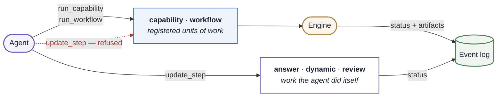
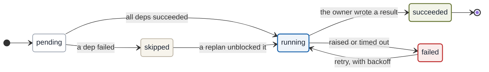
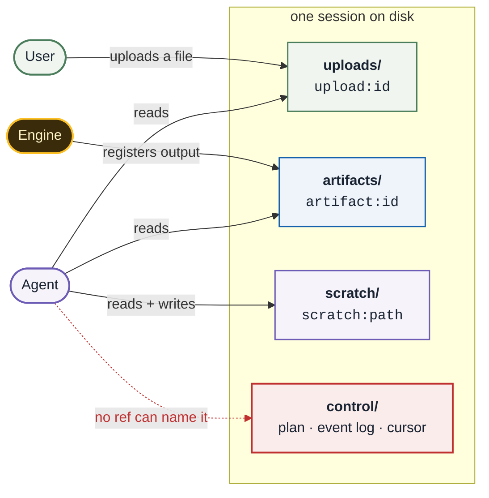

<div align="center">

# LoomCraft

**An AI-native DAG planning and execution engine.**

The agent writes the graph. The server proves it is safe. The engine runs it.
The UI draws it — live.

[](packages/core/pyproject.toml)
[](packages/renderer/package.json)
[](packages/core/pyproject.toml)
[](#testing)
[](LICENSE)

[Quick start](#quick-start) · [Core concepts](#core-concepts) · [Architecture](#architecture) · [Docs](docs/) · [Examples](examples/)

<br>



<sub>The workbench, drawn with the tokens <code>@loomcraft/renderer</code> ships — and a real plan,
from <a href="examples/01-gwas-discovery/">example 1</a>.<br>
Revision <b>2</b>, because revision 1 was confounded and the agent noticed: λ = 2.80 → 0.95, eight hits → three.</sub>

</div>

---

## What this is

Most "AI workflow" tools give you one of two things: a **visual builder** where a
human draws the DAG and the model just fills in a node, or an **agent loop** where
the model does whatever it wants and you find out afterwards.

LoomCraft is the third option. The agent *authors* the task graph at runtime —
shaped to the actual problem, not to a template — but it authors it through a
narrow, validated tool surface. The server checks the graph before anything runs,
owns every execution result, and streams each state change as an event. You get
model-authored flexibility with server-enforced safety, and a UI that shows the
real plan rather than a chat transcript pretending to be one.

<div align="center">

</div>

### What the server guarantees

A plan is not a suggestion the UI decorates. These are enforced, with tests:

- **The graph is a DAG.** Cycles, self-dependencies, unknown dependency targets,
  duplicate ids, and oversized plans are rejected at publish time.
- **A step runs only when its dependencies have succeeded.** The edges are an
  execution precondition, not documentation.
- **The model cannot mark its own work done.** `capability` and `workflow` steps
  are written *only* by their execution tools, so a step reading `succeeded`
  corresponds to a real run that produced real artifacts.
- **Replans are monotonic and explained.** A new revision must increase and must
  carry a `reason`; the old revision is kept for audit.
- **Files are references, never paths.** Inputs are `upload:`/`artifact:`/`scratch:`
  refs, re-resolved and checksum-verified on every use, confined to the session.
- **Loops are bounded.** Per-turn call budgets and repeat detection stop a
  confused model from burning context without progress.

### What you get for free

Parallel scheduling, retry with backoff, timeouts, cancellation that actually
waits, human-approval gates, skip propagation, a hash-chained audit log,
SSE streaming with resume, and a React renderer that reads the same events.

---

## Quick start

```bash
pip install loomcraft            # engine only — one dependency (pydantic)
pip install 'loomcraft[server,anthropic]'   # + FastAPI/SSE + Claude agent
```

**1 · Register what your agent is allowed to do.**

```python
from loomcraft import (
    Capability, CapabilityInput, NodeContext, NodeResult, Port, Registry,
)

registry = Registry()

@registry.capability_runner(Capability(
    id="gwas.kinship",
    name="Genomic relatedness matrix",
    description="Realised kinship between every pair of samples, from genotypes.",
    runner="gwas.kinship",
    inputs=(CapabilityInput(
        key="cohort", name="Cohort", description="A QC'd genotype matrix.",
        allowed_extensions=(".tsv",),
    ),),
    outputs=(Port(name="grm", artifact_type="json"),),
    max_attempts=3,              # retry with exponential backoff
    timeout_seconds=120,
    tags=("gwas", "kinship", "relatedness", "mixed-model"),
))
async def kinship(ctx: NodeContext) -> NodeResult:
    cohort = parse(ctx.input("cohort").read_text())
    ctx.progress(0.5, "standardising markers")
    ctx.emit("grm", "kinship.json", relatedness(cohort))
    return NodeResult.ok(samples=len(cohort.samples))
```

That is the whole extension point. LoomCraft never imports your domain code —
you register a contract and an async callable.

**2 · Give an agent the tools and a session.**

```python
from loomcraft import AnthropicAgent, SessionStore, ToolBroker

session = SessionStore("./data").create()
session.save_upload("cohort.vcf", open("cohort.vcf", "rb"))

broker = ToolBroker(session, registry)
result = await AnthropicAgent().run_turn(
    broker, "Which markers are associated with salt tolerance in this cohort?"
)
```

**3 · Serve it and render it.**

```python
from loomcraft.server import create_app
app = create_app(SessionStore("./data"), registry, lambda _s: AnthropicAgent())
```

```tsx
import { LoomWorkbench } from "@loomcraft/renderer";
import "@loomcraft/renderer/styles.css";

<LoomWorkbench sessionId={sessionId} baseUrl="/api/v1/loomcraft" />
```

**4 · Or run the examples with no API key at all.**

```bash
python examples/01-gwas-discovery/run_scripted.py
python examples/02-literature-meta/run_scripted.py
```

---

## Core concepts

### Plan

A versioned DAG the agent publishes through `publish_plan`. Each step has an
`id`, a `title`, a `kind`, and `depends_on` edges.

```json
{
  "goal": "Find markers associated with salt tolerance in the uploaded cohort",
  "revision": 2,
  "reason": "λ = 2.80 in revision 1 — inflated genome-wide, which is population structure rather than signal",
  "steps": [
    { "id": "qc",      "kind": "capability", "capability": "gwas.qc",        "title": "Quality control" },
    { "id": "pca",     "kind": "capability", "capability": "gwas.pca",       "title": "Ancestry axes",         "depends_on": ["qc"] },
    { "id": "kinship", "kind": "capability", "capability": "gwas.kinship",   "title": "Relatedness matrix",    "depends_on": ["qc"] },
    { "id": "assoc",   "kind": "capability", "capability": "gwas.associate", "title": "Structure-aware scan",  "depends_on": ["qc", "pca", "kinship"] },
    { "id": "correct", "kind": "capability", "capability": "gwas.correct",   "title": "Multiple testing",      "depends_on": ["assoc"] },
    { "id": "review",  "kind": "review",     "title": "Check the model is calibrated", "depends_on": ["correct"] },
    { "id": "answer",  "kind": "answer",     "title": "Report the associated loci",    "depends_on": ["review"] }
  ]
}
```

`pca` and `kinship` both depend only on `qc` and not on each other, so the engine
runs them **concurrently** — that is the layer lighting up twice at once in the
animation at the top of this page. Parallelism is a property of the graph, never
a keyword the plan author has to remember.

Note the `reason`. Revision 1 of this plan had no `pca` or `kinship` step at all;
it went straight from `qc` to a plain per-marker scan. The agent added them
because its own `review` step read a genomic inflation factor of 2.80 off the
artifact and concluded the model — not the arithmetic — was wrong.

### Step kinds

Kind decides *who is allowed to complete the step* — the important half.

| Kind | What it is | Completed by |
| --- | --- | --- |
| `capability` | One registered, typed unit of work | `run_capability` **only** |
| `workflow` | A registered multi-step SOP | `run_workflow` **only** |
| `dynamic` | Work the agent does itself in its sandbox | the agent, via `update_step` |
| `review` | Explicit verification of produced artifacts | the agent, via `update_step` |
| `answer` | Composing the final reply | the agent, via `update_step` |



The dotted edge is the whole point: an agent can *ask* to mark a `capability`
step done, and the broker refuses. A `capability` step reading `succeeded`
therefore always corresponds to a run that really happened.

### Step lifecycle

Statuses are not free-form strings — every write goes through a transition table,
so the log can never contain a step that went backwards.



`succeeded` is terminal — nothing can un-succeed a step, including a replan.
`failed` and `skipped` are not: a retry or a higher revision may put them back
in flight, which is exactly how recovery works without rewriting history.

### Capability

A typed contract: declared inputs (with extensions and cardinality), declared
parameters (with types and ranges), declared outputs, one runner. Because the
contract is data, the *same* declaration produces the agent-facing JSON Schema,
the server-side validation, and the execution graph — they cannot drift apart.

Input **variants** let one capability accept alternatives without accepting
nonsense: `input_variants=(("bed", "bim"), ("vcf",))` means a PLINK pair *or* a
VCF, never half of each.

### Source refs

An input is never a filesystem path. It is `upload:<id>`, `artifact:<id>`, or
`scratch:<relative-path>`, resolved through the session with containment and
integrity checks on every call. A session has four zones with different trust:
`uploads/` (the user's), `artifacts/` (execution output), `scratch/` (the agent's
own workspace), `control/` (server-owned, unreachable by the agent).



Every arrow above is checked on **every** resolution, not once at registration:
the path is re-confined to the session (symlinks included) and the recorded
SHA-256 is re-verified, so a file swapped underneath a ref is caught rather than
consumed.

### Events

Everything observable is an event on an append-only, hash-chained log:
`plan_published`, `step_updated`, `execution_started/progress/finished`,
`artifact_registered`, `input_required/fulfilled/cancelled/invalidated`,
`approval_required/resolved`, `tool_call/result`, `message`, `error`, `done`.

The renderer folds these into state with one pure function — and folds a
persisted history with the *same* function, which is why a live stream and a
mid-run page refresh cannot disagree.

### Replan

When something fails, the agent publishes a higher revision with a `reason`. Old
revisions stay for audit, and the UI offers a revision switcher so a reviewer can
see what the agent believed before and after it learned something.

---

## Architecture

```
packages/core/src/loomcraft/
├── plan.py       Plan/Step models, DAG validation, revision + transition rules
├── graph.py      Pure DAG algorithms (layering, cycles, critical path) — no deps
├── registry.py   Capabilities, workflows, runners — where your domain plugs in
├── context.py    The runner contract: NodeContext / NodeResult
├── engine.py     Async driver: parallel, retry, timeout, approval, cancellation
├── store.py      Sessions, the four zones, source-ref resolution, artifacts
├── events.py     Append-only hash-chained event log + subscriptions
├── inputs.py     Typed file requests + upload→slot allocation
├── tools.py      The 10 agent tools as JSON Schema, in 4 provider dialects
├── broker.py     The only door: validates and dispatches every tool call
├── agent.py      Agent loops — Anthropic, OpenAI-compatible, and scripted
└── server.py     Optional FastAPI router: sessions, uploads, SSE, downloads

packages/renderer/src/
├── state.ts      The event reducer + history hydration (framework-agnostic)
├── layout.ts     Layered DAG layout with crossing reduction — zero dependencies
├── client.ts     HTTP + SSE client with detach/resume semantics
├── useLoomSession.ts   The one hook most hosts need
└── components/   PlanGraph, panels, and a ready-made LoomWorkbench
```

**Dependency budget.** The engine depends on `pydantic` and nothing else.
FastAPI, `anthropic`, and `openai` are optional extras. The renderer's only peer
dependency is React — the DAG layout, the pan/zoom canvas, and the SSE reader are
all first-party, so adding LoomCraft to a UI does not drag in a chart library or
a graph-layout engine.

**Provider neutrality.** `tools.py` emits one canonical tool surface and adapts
it to Anthropic, OpenAI chat, OpenAI Responses, and MCP dialects. The broker
validates calls identically whichever produced them, so swapping models is a
constructor change.

---

## Testing

```bash
pip install -e packages/core   # or: export PYTHONPATH=packages/core/src

cd packages/core     && python -m unittest discover -s tests   # 187 tests
cd packages/renderer && npm ci && npm test                     # 45 tests
```

The core suite runs on the standard library — no pytest required — and covers
DAG validation, revision discipline, the transition state machine, concurrency,
retry, timeouts, approval, cancellation, skip propagation, path traversal,
integrity checks, event-log tampering, allocation, contracts, and every broker
guardrail.

---

## Documentation

| Guide | What's in it |
| --- | --- |
| [Concepts](docs/01-concepts.md) | The model: plans, kinds, capabilities, sessions, events |
| [Defining plans](docs/02-defining-plans.md) | Plan schema, validation rules, transitions, replanning |
| [Agent integration](docs/03-agent-integration.md) | Tool surface, prompting, Claude/OpenAI/MCP, loop design |
| [Frontend integration](docs/04-frontend-integration.md) | Reducer, SSE, components, theming, custom UIs |
| [Extending](docs/05-extending.md) | Runners, capabilities, workflows, storage, transports |
| [Architecture](docs/06-architecture.md) | Design decisions and why they were made that way |
| [API reference](docs/07-api-reference.md) | Every public symbol, tool, event, and endpoint |

---

## License

MIT
