<div align="center">

# LoomCraft

**智能体写计划。服务端守住执行。界面实时画出真实状态。**

LoomCraft 让智能体可以在运行时决定“下一步做什么”，但不能把“其实没发生的事”
写成已经发生。

[English](README.md) · **简体中文**

[](packages/core/pyproject.toml)
[](packages/renderer/package.json)
[](packages/core/pyproject.toml)
[](#测试)
[](LICENSE)

[30 秒示例](#30-秒看懂) · [快速开始](#快速开始) · [架构](#架构) · [文档](docs/) · [示例](examples/)

<br>



<sub>一张计划、一条事件流、三条同时运行的分支。图片使用的卡片几何和状态 token
与 <code>@loomcraft/renderer</code> 完全相同。</sub>

</div>

---

## LoomCraft 解决什么问题

多数 Agent SDK 停在“模型调用工具”这一步；多数工作流引擎则要求用户在任务开始前
就把图固定下来。LoomCraft 把两者接起来：模型在运行时提出计划，宿主决定有哪些能力，
引擎决定哪些步骤现在真的可以执行。

| 层 | 负责什么 | 守住的边界 |
| --- | --- | --- |
| **智能体** | 理解目标、发布版本、解释结果 | 可以提案和观察，不能替服务端操作伪造完成状态 |
| **Broker** | 工具 schema、授权、预算 | 每一次模型动作都经过同一个校验入口 |
| **Engine** | 依赖、并发、重试、产物 | 只有满足图前置条件的步骤才会运行 |
| **Renderer** | 事件日志的可视投影 | 界面不从聊天记录猜状态 |

最重要的一条规则只有一句话：

> **并行是依赖图的属性，不是 prompt 里的关键字。**

三个节点共享一个已完成的父节点、彼此之间没有边时，引擎会在同一轮调度中派发它们。
某条分支失败时，图会记录失败并执行声明好的策略，不会把不完整的执行悄悄说成成功。

## 30 秒看懂

下面是真实的离线运行：不需要 API key、网络、科学计算依赖或前端构建。

```bash
git clone https://github.com/jity16/Loomcraft.git
cd Loomcraft
python -m pip install -e packages/core
python examples/00-workbench-tour/run.py
```

第一个示例会发布一张十一步计划，打印依赖分层，让三条独立分支并发运行，故意重试一次
瞬时失败的步骤，并在最终报告前停在人工审批闸口。输出里的重叠时间是实际测量值：

```text
validation        cycle refused before execution=True
revision 1 · 11 steps
layer 0  normalize
layer 1  kinship + pca + phenotype       ← 同一轮调度
layer 2  scan.yield + scan.depth + scan.height
layer 3  qc.yield + qc.depth + qc.height
layer 4  report                           ← 等待审批

parallel window  pca, phenotype, kinship  overlap=0.16s
retry            scan.depth               attempt 2/2
approval         report                   runner calls=0
run              succeeded                11/11 个节点有记录
report runner    invoked after approval       calls=1
```

更完整的 [`examples/`](examples/) 还覆盖输入请求、产物完整性、重新规划、容错分支、
服务端核验能力、SSE 和 JSON-RPC app-server 桥。
这个开场示例的完整代码和配图在
[`examples/00-workbench-tour/`](examples/00-workbench-tour/)。

## 快速开始

### 1. 注册宿主允许的工作

Registry 是 LoomCraft 与业务代码之间的接缝。Capability 是一份带类型的契约和一个 runner；
LoomCraft 不会 import 你的业务模块。

```python
from loomcraft import Capability, NodeContext, NodeResult, Port, Registry

registry = Registry()

@registry.capability_runner(Capability(
    id="table.profile",
    name="Profile a table",
    description="Count rows and report the column names.",
    runner="table.profile",
    outputs=(Port(name="profile", artifact_type="json"),),
))
async def profile(ctx: NodeContext) -> NodeResult:
    ctx.emit("profile", "profile.json", '{"columns": 12, "rows": 480}')
    return NodeResult.ok(summary="profile complete")
```

### 2. 把会话和工具入口交给智能体

```python
from loomcraft import SessionStore, ToolBroker

session = SessionStore("./.loomcraft-data").create()
broker = ToolBroker(session, registry)
broker.begin_turn()

await broker.dispatch("publish_plan", {"plan": {
    "goal": "Profile the uploaded table",
    "revision": 1,
    "steps": [{
        "id": "profile",
        "title": "Profile the table",
        "kind": "capability",
        "capability": "table.profile",
    }],
}})
run = await broker.dispatch("execute_plan", {})
assert run.ok and run.result["status"] == "succeeded"
```

把直接调用换成 `AnthropicAgent`、`OpenAICompatibleAgent`、`SubprocessAgent`，或者实现
`Agent.run_turn(...)` 协议即可；Broker 和 Engine 的保证不会改变。

### 3. 需要界面时接入 Renderer

```bash
cd packages/renderer
npm ci
npm run build
cd /你的项目
npm install /path/to/Loomcraft/packages/renderer
```

```tsx
import { LoomWorkbench } from "@loomcraft/renderer";
import "@loomcraft/renderer/styles.css";

<LoomWorkbench sessionId={sessionId} baseUrl="/api/v1/loomcraft" />
```

也可以只使用 `reduceLoomEvent` / `hydrateLoomState` 这两个纯函数，或单独嵌入 `PlanGraph`。

## 计划的形状

开头的示例不是线性的 hello-world，而是一张真实的扇出/汇聚图：

```text
                         ┌─ scan.yield  ── qc.yield  ─┐
normalize ─┬─ pca ────────┤                             │
           ├─ phenotype ──┼─ scan.depth  ── qc.depth ──┼─ report
           └─ kinship ────┤                             │
                         └─ scan.height ── qc.height ─┘
```

边是执行前置条件。`pca`、`phenotype`、`kinship` 只共享 `normalize`，互相没有依赖，
因此会一起运行；三个扫描和三个核验也一样。没有容易忘记的 `parallel=True` 开关，
也不需要让模型耗费轮次把本来独立的工作串起来。

## 引擎保证

- **运行前校验图。** 环、重复 id、未知依赖、超大计划和未授权能力都会在 Broker 边界被拒绝。
- **模型不能伪造服务端工作。** `capability` 和 `workflow` 只能由执行工具完成；核验能力也可以归服务端所有。
- **每个结果都有凭证。** 状态、重试、进度、产物、审批和错误都写入带单调序号、可验证哈希链的只追加事件。
- **文件是引用，不是路径。** `upload:`、`artifact:`、`scratch:` 引用始终限制在会话内，并在读取时重新校验完整性。
- **恢复过程显式可见。** 重试有上限，超时和取消会等待真正停止，失败策略和重新规划理由都会留在记录里。

## 架构

```text
用户请求 / 文件
       │
       ▼
 Agent / 模型运行时 ── 发布 ──► Plan + 版本历史
       │                         │
       │ 工具调用                ▼
       └──────────────────► ToolBroker
                                  │ 校验 + 授权
                                  ▼
             宿主 Registry ───► Engine ───► EventLog
             （你的 runner）       │             │
                                  │             └── SSE / history
                                  ▼                    │
                              artifacts             Renderer
```

Python 核心包在 [`packages/core/src/loomcraft/`](packages/core/src/loomcraft/)，React 包在
[`packages/renderer/`](packages/renderer/)。两者共享事件契约，但彼此不绑定实现语言。

## 接入自己的模型运行时

所有适配器最终都走同一个 Broker：

| 运行时 | 入口 |
| --- | --- |
| Anthropic | `AnthropicAgent()` |
| OpenAI 兼容 Chat/Responses | `OpenAICompatibleAgent(...)` |
| 另一个进程（JSONL） | `SubprocessAgent([...])` |
| Codex / app-server | `AppServerBridge(broker)` |
| 自定义模型运行时 | 实现 `Agent.run_turn(...)` 协议 |

`tools.py` 生成一份规范工具目录，再适配 Anthropic、OpenAI、Responses 和 MCP 方言。
换模型是换 Provider，不会产生第二条执行路径。

## 文档和示例

从 [`docs/README.md`](docs/README.md) 开始：

- [概念](docs/01-concepts.md)：计划、步骤、能力、会话、事件
- [定义计划](docs/02-defining-plans.md)：schema、校验、策略、objectives
- [Agent 集成](docs/03-agent-integration.md)：工具、循环、Provider、守卫
- [前端集成](docs/04-frontend-integration.md)：reducer、SSE、组件、主题
- [扩展](docs/05-extending.md)：runner、workflow、存储、传输层
- [架构](docs/06-architecture.md)：设计决策和取舍
- [API 参考](docs/07-api-reference.md)：公开 Python、TypeScript、事件和端点

可运行场景见 [`examples/README.md`](examples/README.md)，机器可读的 Plan/Event/Tool 契约见
[`packages/core/schema/`](packages/core/schema/)。

## 测试

```bash
python -m pip install -e "packages/core[dev]"
python -m pytest -q                         # Python 257 个测试
python -m ruff check packages/core/src --select F,E9,B023
python tools/check_docs.py

npm --prefix packages/renderer ci
npm --prefix packages/renderer run typecheck
npm --prefix packages/renderer run build
npm --prefix packages/renderer test             # Renderer 54 个测试
```

## 许可证

MIT
