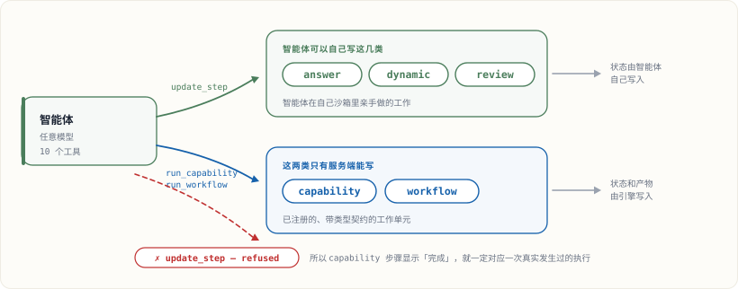
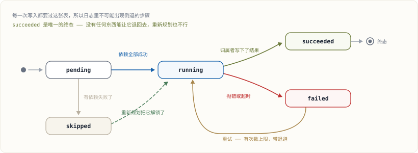
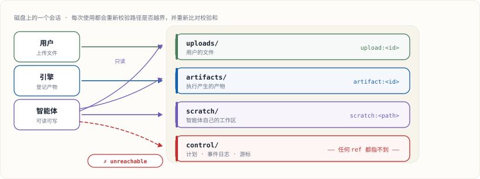

<div align="center">

# LoomCraft

**一个 AI 原生的 DAG 规划与执行引擎。**

图由智能体来写。服务端来证明它是安全的。引擎来跑它。
界面把它画出来 —— 实时地。

[English](README.md) · **简体中文**

[](packages/core/pyproject.toml)
[](packages/renderer/package.json)
[](packages/core/pyproject.toml)
[](#测试)
[](LICENSE)

[快速开始](#快速开始) · [核心概念](#核心概念) · [架构](#架构) · [文档](docs/) · [示例](examples/)

<br>



<sub>这就是工作台本身，用 <code>@loomcraft/renderer</code> 自带的设计 token 画的 —— 计划也是真的，
来自<a href="examples/01-gwas-discovery/">示例 1</a>。<br>
第 <b>1</b> 版跑完后，它自己的 <code>review</code> 步骤从产物里读出 λ = 2.80，于是智能体把整个计划换掉。<br>
第 <b>2</b> 版补上了它原本缺的两个步骤 —— 而这两步之间没有依赖边，所以引擎让它们同时跑。</sub>

</div>

---

## 这是什么

大多数「AI 工作流」工具只给你两种东西之一：要么是一个**可视化编排器**，DAG 由人画出来，
模型只负责填某一个节点；要么是一个**智能体循环**，模型爱干什么干什么，你事后才知道它干了什么。

LoomCraft 是第三条路。任务图由智能体在运行时**自己写**——按真实问题的形状来写，而不是套模板——
但它只能通过一个狭窄的、经过校验的工具面来写。服务端在任何东西开跑之前先检查这张图，
独占每一次执行结果的写入权，并把每一次状态变化作为事件推流出去。你同时拿到了模型带来的灵活性
和服务端强制保证的安全性，以及一个真正展示计划的界面——而不是一段假装自己是计划的聊天记录。

<div align="center">

</div>

### 服务端保证了什么

计划不是一个「界面拿来装点门面」的建议。下面这些都是强制执行的，而且有测试覆盖：

- **图一定是 DAG。** 环、自依赖、指向不存在节点的依赖、重复 id、超大计划，都会在发布时被拒绝。
- **一个步骤只有在它的依赖全部成功之后才会运行。** 边是执行的前置条件，不是文档。
- **模型不能把自己的活儿标记成「干完了」。** `capability` 和 `workflow` 步骤**只能**由它们各自的
  执行工具写入，所以一个步骤显示 `succeeded`，就一定对应一次真实发生过、产出了真实产物的执行。
- **重新规划是单调的，而且必须给出理由。** 新版本号必须递增，并且必须带 `reason`；旧版本会保留以供审计。
- **文件是引用，永远不是路径。** 输入是 `upload:` / `artifact:` / `scratch:` 引用，
  每次使用都会重新解析、重新校验校验和，并且被限制在会话内部。
- **循环是有界的。** 每轮的调用预算和重复检测，会拦住一个已经绕晕了、只是在烧上下文而没有进展的模型。

### 你不用自己写的部分

并行调度、带退避的重试、超时、真正会等待的取消、人工审批闸口、跳过传播、哈希链审计日志、
可续传的 SSE 推流，以及一个读取同一份事件流的 React 渲染器。

---

## 快速开始

```bash
pip install loomcraft            # 只要引擎 —— 只有一个依赖（pydantic）
pip install 'loomcraft[server,anthropic]'   # 再加 FastAPI/SSE + Claude 智能体
```

**1 · 注册你允许智能体做的事。**

```python
from loomcraft import (
    Capability, CapabilityInput, NodeContext, NodeResult, Port, Registry,
)

registry = Registry()

@registry.capability_runner(Capability(
    id="gwas.kinship",
    name="基因组亲缘关系矩阵",
    description="从基因型计算任意两个样本之间的实测亲缘关系。",
    runner="gwas.kinship",
    inputs=(CapabilityInput(
        key="cohort", name="群体", description="已质控的基因型矩阵。",
        allowed_extensions=(".tsv",),
    ),),
    outputs=(Port(name="grm", artifact_type="json"),),
    max_attempts=3,              # 带指数退避的重试
    timeout_seconds=120,
    tags=("gwas", "kinship", "relatedness", "mixed-model"),
))
async def kinship(ctx: NodeContext) -> NodeResult:
    cohort = parse(ctx.input("cohort").read_text())
    ctx.progress(0.5, "正在标准化位点")
    ctx.emit("grm", "kinship.json", relatedness(cohort))
    return NodeResult.ok(samples=len(cohort.samples))
```

扩展点就这一个。LoomCraft 从不 import 你的业务代码 —— 你只是注册了一份契约和一个 async 可调用对象。

**2 · 把工具和一个会话交给智能体。**

```python
from loomcraft import AnthropicAgent, SessionStore, ToolBroker

session = SessionStore("./data").create()
session.save_upload("cohort.vcf", open("cohort.vcf", "rb"))

broker = ToolBroker(session, registry)
result = await AnthropicAgent().run_turn(
    broker, "这个群体里哪些位点跟耐盐性有关联？"
)
```

**3 · 起服务，然后渲染。**

```python
from loomcraft.server import create_app
app = create_app(SessionStore("./data"), registry, lambda _s: AnthropicAgent())
```

```tsx
import { LoomWorkbench } from "@loomcraft/renderer";
import "@loomcraft/renderer/styles.css";

<LoomWorkbench sessionId={sessionId} baseUrl="/api/v1/loomcraft" />
```

**4 · 或者完全不用 API key，直接跑示例。**

```bash
python examples/01-gwas-discovery/run_scripted.py
python examples/02-literature-meta/run_scripted.py
```

---

## 核心概念

### Plan（计划）

一张带版本号的 DAG，由智能体通过 `publish_plan` 发布。每个步骤都有 `id`、`title`、`kind`
和 `depends_on` 依赖边。

```json
{
  "goal": "在上传的群体中找出与耐盐性关联的位点",
  "revision": 2,
  "reason": "第 1 版 λ = 2.80 —— 全基因组范围被抬高，这是群体结构，不是信号",
  "steps": [
    { "id": "qc",      "kind": "capability", "capability": "gwas.qc",        "title": "基因型质控" },
    { "id": "pca",     "kind": "capability", "capability": "gwas.pca",       "title": "祖先主成分",     "depends_on": ["qc"] },
    { "id": "kinship", "kind": "capability", "capability": "gwas.kinship",   "title": "亲缘关系矩阵",   "depends_on": ["qc"] },
    { "id": "assoc",   "kind": "capability", "capability": "gwas.associate", "title": "考虑结构的扫描", "depends_on": ["qc", "pca", "kinship"] },
    { "id": "correct", "kind": "capability", "capability": "gwas.correct",   "title": "多重检验校正",   "depends_on": ["assoc"] },
    { "id": "review",  "kind": "review",     "title": "核验模型是否校准", "depends_on": ["correct"] },
    { "id": "answer",  "kind": "answer",     "title": "汇报关联位点",     "depends_on": ["review"] }
  ]
}
```

`pca` 和 `kinship` 都只依赖 `qc`，彼此之间没有依赖，所以引擎会**并发**跑它们 ——
也就是本页顶部动图里那一层同时亮起来的两个节点。**并行是图的形状决定的属性**，
而不是一个需要计划作者记住的关键字。

注意那个 `reason`。这个计划的第 1 版里根本没有 `pca` 和 `kinship` 步骤，
它是从 `qc` 直接进到一次朴素的逐位点扫描的。智能体之所以补上这两步，
是因为它自己的 `review` 步骤从产物里读出了 2.80 的基因组膨胀因子，
从而判定错的是**模型**，不是算术。

### 步骤的 kind

kind 决定的是**谁有权把这个步骤标记为完成** —— 这才是重要的那一半。

| Kind | 是什么 | 由谁完成 |
| --- | --- | --- |
| `capability` | 一个已注册的、带类型契约的原子工作单元 | **只能**由 `run_capability` |
| `workflow` | 一个已注册的多步 SOP | **只能**由 `run_workflow` |
| `dynamic` | 智能体在自己沙箱里亲手做的工作 | 智能体，通过 `update_step` |
| `review` | 对已产出产物的显式核验 | 智能体，通过 `update_step` |
| `answer` | 组织最终回复 | 智能体，通过 `update_step` |

<div align="center">

</div>

那条红色虚线才是重点：智能体**可以去要求**把一个 `capability` 步骤标记为完成，而 broker 会拒绝。
所以一个 `capability` 步骤显示 `succeeded`，就永远对应一次真实发生过的执行。

### 步骤的生命周期

状态不是可以随便写的字符串 —— 每一次写入都要过一张转移表，
所以日志里不可能出现一个「倒退」了的步骤。

<div align="center">

</div>

`succeeded` 是终态 —— 没有任何东西能让一个步骤退出成功状态，重新规划也不行。
`failed` 和 `skipped` 则不是：一次重试或一个更高的版本可以把它们重新放回执行队列，
这正是「不改写历史也能恢复」的做法。

### Capability（能力）

一份带类型的契约：声明输入（含扩展名和数量约束）、声明参数（含类型和取值范围）、
声明输出、一个 runner。因为这份契约本身就是数据，所以**同一份声明**同时产出了三样东西：
面向智能体的 JSON Schema、服务端的校验逻辑、以及引擎的执行图 —— 它们不可能各自漂移。

输入的 **variants** 让一个能力可以接受多种备选形态，同时又不接受胡来的组合：
`input_variants=(("bed", "bim", "fam"), ("vcf",))` 的意思是「一整套 PLINK 三件套
**或者** 一个 VCF」，绝不接受各取一半。

### Source ref（来源引用）

输入永远不是文件系统路径。它是 `upload:<id>`、`artifact:<id>` 或 `scratch:<相对路径>`，
每一次调用都要经过会话解析，并做越界检查和完整性检查。一个会话有四个信任级别不同的区：
`uploads/`（属于用户）、`artifacts/`（执行产物）、`scratch/`（智能体自己的工作区）、
`control/`（服务端独占，智能体触及不到）。

<div align="center">

</div>

上图里的每一根箭头，在**每一次**解析时都会被重新检查，而不是注册时查一次就完事：
路径会被重新约束在会话内（软链接也算），记录的 SHA-256 会被重新比对 ——
所以一个在引用背后被掉包的文件会被抓出来，而不是被照单全收。

### Events（事件）

一切可观察的东西都是只追加、哈希链日志上的一个事件：
`plan_published`、`step_updated`、`execution_started/progress/finished`、
`artifact_registered`、`input_required/fulfilled/cancelled/invalidated`、
`approval_required/resolved`、`tool_call/result`、`message`、`error`、`done`。

渲染器用**一个纯函数**把这些折叠成状态 —— 并且用**同一个函数**折叠持久化的历史记录。
这就是为什么实时推流和跑到一半刷新页面，两者不可能给出不一致的结果。

### Replan（重新规划）

出问题的时候，智能体会发布一个更高的版本，并带上 `reason`。旧版本会保留以供审计，
界面也提供版本切换器，这样审阅者可以看到智能体在「学到某件事」前后分别相信的是什么。

---

## 架构

```
packages/core/src/loomcraft/
├── plan.py       Plan/Step 模型、DAG 校验、版本与状态转移规则
├── graph.py      纯 DAG 算法（分层、环检测、关键路径）—— 零依赖
├── registry.py   能力、工作流、runner —— 你的业务在这里接入
├── context.py    runner 的契约：NodeContext / NodeResult
├── engine.py     异步驱动：并行、重试、超时、审批、取消
├── store.py      会话、四个信任区、source ref 解析、产物
├── events.py     只追加的哈希链事件日志 + 订阅
├── inputs.py     带类型的文件请求 + 上传到槽位的分配
├── tools.py      10 个智能体工具的 JSON Schema，4 种厂商方言
├── broker.py     唯一的入口：校验并派发每一次工具调用
├── agent.py      智能体循环 —— Anthropic、OpenAI 兼容、脚本化
└── server.py     可选的 FastAPI 路由：会话、上传、SSE、下载

packages/renderer/src/
├── state.ts      事件 reducer + 历史 hydration（与框架无关）
├── layout.ts     带交叉削减的分层 DAG 布局 —— 零依赖
├── client.ts     HTTP + SSE 客户端，带 detach/续传语义
├── useLoomSession.ts   大多数宿主只需要这一个 hook
└── components/   PlanGraph、各类面板，以及开箱即用的 LoomWorkbench
```

**依赖预算。** 引擎只依赖 `pydantic`，别的一概没有。FastAPI、`anthropic`、`openai`
都是可选的 extras。渲染器唯一的 peer 依赖是 React —— DAG 布局、平移缩放画布、SSE 读取器
全是自己写的，所以把 LoomCraft 加进一个界面里，不会顺带拖进来一个图表库或者图布局引擎。

**厂商中立。** `tools.py` 产出一份规范的工具面，并把它适配到 Anthropic、OpenAI chat、
OpenAI Responses 和 MCP 四种方言。不管调用来自哪一种，broker 的校验逻辑完全一致 ——
所以换模型只是改一行构造函数。

---

## 测试

```bash
pip install -e packages/core   # 或者：export PYTHONPATH=packages/core/src

cd packages/core     && python -m unittest discover -s tests   # 187 个测试
cd packages/renderer && npm ci && npm test                     # 45 个测试
```

核心测试套件只用标准库跑 —— 不需要 pytest —— 覆盖了 DAG 校验、版本纪律、状态转移机、
并发、重试、超时、审批、取消、跳过传播、路径穿越、完整性校验、事件日志篡改、
槽位分配、契约，以及 broker 的每一道防线。

---

## 文档

> 详细文档目前只有英文版。

| 指南 | 内容 |
| --- | --- |
| [Concepts](docs/01-concepts.md) | 模型本身：计划、kind、能力、会话、事件 |
| [Defining plans](docs/02-defining-plans.md) | 计划 schema、校验规则、状态转移、重新规划 |
| [Agent integration](docs/03-agent-integration.md) | 工具面、提示词、Claude/OpenAI/MCP、循环设计 |
| [Frontend integration](docs/04-frontend-integration.md) | reducer、SSE、组件、主题、自定义界面 |
| [Extending](docs/05-extending.md) | runner、能力、工作流、存储、传输层 |
| [Architecture](docs/06-architecture.md) | 设计决策，以及为什么这么定 |
| [API reference](docs/07-api-reference.md) | 每一个公开符号、工具、事件和接口 |

---

## 许可证

MIT
